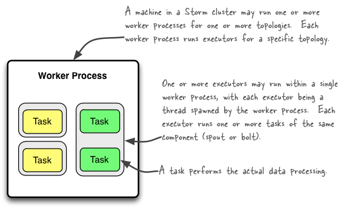

## Realtime analytics with Storm


---
= data-x="1000" data-y="-500" 
## Evolution Towards Big Data

* Fault tolerance is hard
* Relation databases don't scale well
* Sheer volume
* Demand
* Data science

---
= data-x="1000" data-y="-500" 

## Persistent Architecture Problems

* Conflicting performance requirements
* CAP
* Database gets corrupted:
	* Admin cock up
	* Bug in your code
	* Power dies
	* Solar Radiation…

*Mutable State*	

---
= data-x="1000" data-y="500" 

## Typcial Solutions

* Replication
* Periodic Backup
* Hope and Pray
* Domain segregation of  concerns
* Risk averse design that destroys performance

---
= data-x="2000" data-y="0" data-scale="0.1" 

## I know

We can have immuatable state and rebuild our state from scratch if required

``` clojure
(defn Solution [] 
    (let [BigData Hadoop]
        (BuildView BigData)))
```
*or*

``` clojure
(defn Solution [] 
    (install hBase))
```

---
= data-x="1100" data-y="-500"

``` clojure
(is (= [["Realtime" true]] (Solution)))
(is (= [["Consistent" true]] (Solution)))
(is (= [["Operational Demands Met" true]] (Solution)))
(is (= [["Productive" true]] (Solution)))
(is (< [["HIGH_TCO" true]] (Solution)))
```
*Data systems are an eco-system*

--- 
= data-x="1300" data-y="-500"
## Solution Properties

* Satisfy a wide range of use cases
* Fundamentally fault tolerant
* Scalable
* Low Latency
* Massive data volume
* Structured and unstructured data
* Bounded complexity

---
= data-x="1300" data-y="-500" data-scale="2.0" 
## What is Storm?
* Distributed
* Realtime
* Broad set of use cases 
* Supports transactional schemantics
* Robust
* Polyglot
* Low Latency Processing

---
= data-x="1350" data-y="-500" data-scale="2.0" 
### Log Topology

``` java
builder.setSpout("logSpout", new LogSpout(), 10);

builder.setBolt("logRules", new LogRulesBolt(), 
	10).shuffleGrouping("logSpout");
builder.setBolt("indexer", 
	new IndexerBolt(), 10).
	shuffleGrouping("logRules");
builder.setBolt("counter", 
	new VolumeCountingBolt(), 10).
	shuffleGrouping("logRules");
CassandraCounterBatchingBolt logPersistenceBolt = 
	new CassandraCounterBatchingBolt(
		Conf.COUNT_CF_NAME, 
		VolumeCountingBolt.FIELD_ROW_KEY, 
		VolumeCountingBolt.FIELD_INCREMENT );
logPersistenceBolt.setAckStrategy(AckStrategy.ACK_ON_RECEIVE);
builder.setBolt("countPersistor", 
	logPersistenceBolt, 10)	.shuffleGrouping("counter");
```

---
= data-x="1400" data-y="-500" data-scale="2.0" 
### Log Topology


---
= data-x="1350" data-y="-500" data-scale="2.0" 
### Log Topology

``` java
builder.setSpout("logSpout", new LogSpout(), 10);

builder.setBolt("logRules", new LogRulesBolt(), 
	10).shuffleGrouping("logSpout");
```

---
= data-x="1350" data-y="-500" data-scale="2.0" 
### Log Topology

``` java
builder.setBolt("indexer", 
	new IndexerBolt(), 10).
	shuffleGrouping("logRules");
builder.setBolt("counter", 
	new VolumeCountingBolt(), 10).
	shuffleGrouping("logRules");
CassandraCounterBatchingBolt logPersistenceBolt = 
	new CassandraCounterBatchingBolt(
		Conf.COUNT_CF_NAME, 
		VolumeCountingBolt.FIELD_ROW_KEY, 
		VolumeCountingBolt.FIELD_INCREMENT );
logPersistenceBolt.setAckStrategy(
	AckStrategy.ACK_ON_RECEIVE);
builder.setBolt("countPersistor", 
	logPersistenceBolt, 10)	.shuffleGrouping("counter");
```

---
= data-x="1450" data-y="-500" data-scale="2.0"
### Spout

``` java
public void nextTuple() {
    String content = jedis.rpop(LOG_CHANNEL);
    if(content==null || "nil".equals(content)) {
         try { Thread.sleep(300); } 
         catch (InterruptedException e) {}
    } else {
        JSONObject obj=(JSONObject)JSONValue.
        	parse(content);
        LogEntry entry = new LogEntry(obj);
        collector.emit(new Values(entry));
    }
}
```

---
= data-x="1500" data-y="-500" data-scale="2.0"
### Bolt

``` java
public void execute(Tuple input) {
	LogEntry entry = (LogEntry)input.
		getValueByField(FieldNames.LOG_ENTRY);
	if(entry == null){
		return;
	}
	ksession.execute( entry );
	if(!entry.isFilter()){
		LOG.debug("Emitting from Rules Bolt");
		collector.emit(new Values(entry));
	}
}
```

---
= data-x="1500" data-y="-500" data-scale="2.0"
### Rules

``` 
rule "Filter By Type"
    when
        l: LogEntry(type != "syslog")
    then
        l.setFilter(true);
end
rule "Extract Fields"
	salience 100//run later
	when
		l: LogEntry(filter != true)
	then
		String logEntryPattern = "^([\\d.]+) (\\S+) (\\S+) \\[([\\w:/]+\\s[+\\-]\\d{4})\\] \"(.+?)\" (\\d{3}) (\\d+) \"([^\"]+)\" \"([^\"]+)\"";
		Matcher matcher = Pattern.compile(logEntryPattern).matcher(l.getMessage());
		if(matcher.find()){
			l.addField("_pid",matcher.group(1));
			l.addField("_src",matcher.group(2));
		}
end
```

---
= data-x="1550" data-y="-500" data-scale="2.0"
### Bolt

``` java
@Override
public void execute(Tuple input) {
	LogEntry entry = (LogEntry)input.
		getValueByField(FieldNames.LOG_ENTRY);
	if(entry == null)
		return;
	String toBeIndexed = entry.toJSON().
		toJSONString();
	IndexResponse response = client
			.prepareIndex(INDEX_NAME,INDEX_TYPE)
			.setSource(toBeIndexed)
			.execute().actionGet();
	if(response == null)
		collector.emit(new Values(entry,
			response.getId()));
}
```

---
= data-x="1350" data-y="-500"
## Parallel


---
= data-x="1400" data-y="-500"
## Parallel Streams


---
= data-x="1450" data-y="-500"
## Grouping


---
= data-x="1500" data-y="-500"
## Concepts

* Immutability
* Bound Complexity
* Commutative Vs Associative
* Partitioning
* Consistency
* Time

--- 
= data-x="1500" data-y="-500" data-scale="0.2" 
## Big Data Architecture


---
= data-x="1500" data-y="-500" data-scale="0.1" 
## Appropriate Abstractions

* Map Reduce low level
* Sometimes you need a higher level of abstraction
	* Cascading
	* Cascalog
	* Scalding 

---
= data-x="1500" data-y="-500" data-scale="0.3" 
## Cascalog

``` clojure
(defn word-count [src]
  "simple word count across all documents"
  (<- [?word ?count]
      (src _ ?word)
      (c/count ?count)))

(defn TF [src]
  (<- [?doc-id ?tf-word ?tf-count]
      (src ?doc-id ?tf-word)
      (c/count ?tf-count)))
```

---
= data-x="1500" data-y="-600" data-scale="0.2" 
## Trident

``` clojure

(defbolt word-count ["word" "count"] {:prepare true}
 [conf context collector]
 (let [counts (atom {})]
  (bolt
   (execute [tuple]
    (let [word (.getString tuple 0)]
     (swap! counts (partial merge-with +) 
     	{word 1})
     (emit-bolt! collector 
     	[word (@counts word)] 
     	:anchor tuple)
     (ack! collector tuple))))))
```

---
= data-x="0" data-y="0"
## Operational Predictive Analytics

```

f <- as.formula("as.factor(species) ~ .")
fit <- randomForest(f, data=iris_train, 
			proximity=TRUE, ntree=50)
saveXML(pmml(fit), file=paste(dat_folder, 
			"iris.rf.xml", sep="/"))
```

---
= data-x="0" data-y="0" data-scale="0.5" 
## AWS Deployment

```
lein deploy-storm --start --name mycluster --release 0.8.2
storm jar X-standalone.jar com.company.Topology 

```

---
= data-x="100" data-y="0" data-scale="0.2" 
## Future Efforts

* Realtime predictive analytics - Neural Networks
* Tighter Integration with R

---
= data-x="500" data-y="0" data-scale="0.2"
## Other Options

* Spark
* S4
* Akka
* Etc…

---
## More Information

* http://storm-project.net/
* https://github.com/nathanmarz/storm/
* http://nathanmarz.com/blog/how-to-beat-the-cap-theorem.html
* http://www.cascading.org/
* @qanderson7
* quintona.github.com
* http://www.michael-noll.com/
* http://storm-presentation.s3-website-ap-southeast-2.amazonaws.com/
